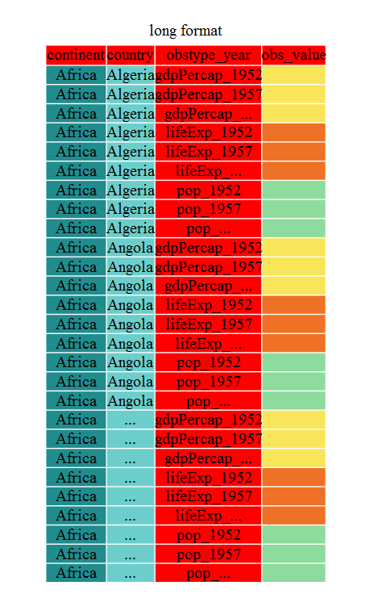

## Getting started

Load the tidyverse packages, which includes the package tidyr.

~~~
library("tidyverse")
~~~
{: .language-r}

> ## Tip: Seeing which packages are imported
>
> You can get useful information about your R session, including which packages are
> imported, with `sessionInfo()`
{: .callout}

First, lets look at the structure of our original gapminder dataframe. Because it's a tibble, we can just print it, or use `str()`:

~~~
gapminder
~~~
{: .language-r}

~~~
# A tibble: 1,704 x 6
   country      year       pop continent lifeExp gdpPercap
   <chr>       <int>     <dbl> <chr>       <dbl>     <dbl>
 1 Afghanistan  1952  8425333. Asia         28.8      779.
 2 Afghanistan  1957  9240934. Asia         30.3      821.
 3 Afghanistan  1962 10267083. Asia         32.0      853.
 4 Afghanistan  1967 11537966. Asia         34.0      836.
 5 Afghanistan  1972 13079460. Asia         36.1      740.
 6 Afghanistan  1977 14880372. Asia         38.4      786.
 7 Afghanistan  1982 12881816. Asia         39.9      978.
 8 Afghanistan  1987 13867957. Asia         40.8      852.
 9 Afghanistan  1992 16317921. Asia         41.7      649.
10 Afghanistan  1997 22227415. Asia         41.8      635.
# ... with 1,694 more rows
~~~
{: .output}

> ## Challenge 1
>
> Is gapminder a purely long, purely wide, or some intermediate format?
>
>
> > ## Solution to Challenge 1
> >
> > The original gapminder data.frame is in an intermediate format. It is not
> > purely long since it had multiple observation variables
> > (`pop`,`lifeExp`,`gdpPercap`).
> {: .solution}
{: .challenge}

Sometimes, as with the gapminder dataset, we have multiple types of observed
data. It is somewhere in between the purely 'long' and 'wide' data formats. We
have 3 "ID variables" (`continent`, `country`, `year`) and 3 "Observation
variables" (`pop`,`lifeExp`,`gdpPercap`). I usually prefer my data in this
intermediate format in most cases despite not having ALL observations in 1
column given that all 3 observation variables have different units. There are
few operations that would need us to stretch out this dataframe any longer
(i.e. 4 ID variables and 1 Observation variable).

While using many of the functions in R, which are often vector based, you
usually do not want to do mathematical operations on values with different
units. For example, using the purely long format, a single mean for all of the
values of population, life expectancy, and GDP would not be meaningful since it
would return the mean of values with 3 incompatible units. The solution is that
we first manipulate the data either by grouping (see the lesson on `dplyr`), or
we change the structure of the dataframe.  **Note:** Some plotting functions in
R actually work better in the wide format data.

## From wide to long format with gather()

Until now, we've been using the nicely formatted original gapminder dataset, but
'real' data (i.e. our own research data) will never be so well organized. Here
let's start with the wide format version of the gapminder dataset.

> Download the wide version of the gapminder data from [here](https://raw.githubusercontent.com/swcarpentry/r-novice-gapminder/gh-pages/_episodes_rmd/data/gapminder_wide.csv)
and save it in your data folder.

We'll load the data file and look at it.  Note: we don't want our continent and
country columns to be factors, so if you're using `read.csv`, remember the stringsAsFactors argument to disable that. `read_csv()` doesn't convert strings to factors by default. It also gives output to describe how it's treating each column as they are read in.

~~~
gap_wide <- read_csv("data/gapminder_wide.csv")
~~~
{: .language-r}

~~~
Parsed with column specification:
cols(
  .default = col_double(),
  continent = col_character(),
  country = col_character(),
  pop_2002 = col_integer(),
  pop_2007 = col_integer()
)
~~~
{: .output}

~~~
See spec(...) for full column specifications.
~~~
{: .output}

~~~
str(gap_wide)
~~~
{: .language-r}

~~~
Classes 'tbl_df', 'tbl' and 'data.frame':	142 obs. of  38 variables:
 $ continent     : chr  "Africa" "Africa" "Africa" "Africa" ...
 $ country       : chr  "Algeria" "Angola" "Benin" "Botswana" ...
 $ gdpPercap_1952: num  2449 3521 1063 851 543 ...
 $ gdpPercap_1957: num  3014 3828 960 918 617 ...
 $ gdpPercap_1962: num  2551 4269 949 984 723 ...
 $ gdpPercap_1967: num  3247 5523 1036 1215 795 ...
 $ gdpPercap_1972: num  4183 5473 1086 2264 855 ...
 $ gdpPercap_1977: num  4910 3009 1029 3215 743 ...
 $ gdpPercap_1982: num  5745 2757 1278 4551 807 ...
 $ gdpPercap_1987: num  5681 2430 1226 6206 912 ...
 $ gdpPercap_1992: num  5023 2628 1191 7954 932 ...
 $ gdpPercap_1997: num  4797 2277 1233 8647 946 ...
 $ gdpPercap_2002: num  5288 2773 1373 11004 1038 ...
 $ gdpPercap_2007: num  6223 4797 1441 12570 1217 ...
 $ lifeExp_1952  : num  43.1 30 38.2 47.6 32 ...
 $ lifeExp_1957  : num  45.7 32 40.4 49.6 34.9 ...
 $ lifeExp_1962  : num  48.3 34 42.6 51.5 37.8 ...
 $ lifeExp_1967  : num  51.4 36 44.9 53.3 40.7 ...
 $ lifeExp_1972  : num  54.5 37.9 47 56 43.6 ...
 $ lifeExp_1977  : num  58 39.5 49.2 59.3 46.1 ...
 $ lifeExp_1982  : num  61.4 39.9 50.9 61.5 48.1 ...
 $ lifeExp_1987  : num  65.8 39.9 52.3 63.6 49.6 ...
 $ lifeExp_1992  : num  67.7 40.6 53.9 62.7 50.3 ...
 $ lifeExp_1997  : num  69.2 41 54.8 52.6 50.3 ...
 $ lifeExp_2002  : num  71 41 54.4 46.6 50.6 ...
 $ lifeExp_2007  : num  72.3 42.7 56.7 50.7 52.3 ...
 $ pop_1952      : num  9279525 4232095 1738315 442308 4469979 ...
 $ pop_1957      : num  10270856 4561361 1925173 474639 4713416 ...
 $ pop_1962      : num  11000948 4826015 2151895 512764 4919632 ...
 $ pop_1967      : num  12760499 5247469 2427334 553541 5127935 ...
 $ pop_1972      : num  14760787 5894858 2761407 619351 5433886 ...
 $ pop_1977      : num  17152804 6162675 3168267 781472 5889574 ...
 $ pop_1982      : num  20033753 7016384 3641603 970347 6634596 ...
 $ pop_1987      : num  23254956 7874230 4243788 1151184 7586551 ...
 $ pop_1992      : num  26298373 8735988 4981671 1342614 8878303 ...
 $ pop_1997      : num  29072015 9875024 6066080 1536536 10352843 ...
 $ pop_2002      : int  31287142 10866106 7026113 1630347 12251209 7021078 15929988 4048013 8835739 614382 ...
 $ pop_2007      : int  33333216 12420476 8078314 1639131 14326203 8390505 17696293 4369038 10238807 710960 ...
 - attr(*, "spec")=List of 2
  ..$ cols   :List of 38
  .. ..$ continent     : list()
  .. .. ..- attr(*, "class")= chr  "collector_character" "collector"
  .. ..$ country       : list()
  .. .. ..- attr(*, "class")= chr  "collector_character" "collector"
  .. ..$ gdpPercap_1952: list()
  .. .. ..- attr(*, "class")= chr  "collector_double" "collector"
  .. ..$ gdpPercap_1957: list()
  .. .. ..- attr(*, "class")= chr  "collector_double" "collector"
  .. ..$ gdpPercap_1962: list()
  .. .. ..- attr(*, "class")= chr  "collector_double" "collector"
  .. ..$ gdpPercap_1967: list()
  .. .. ..- attr(*, "class")= chr  "collector_double" "collector"
  .. ..$ gdpPercap_1972: list()
  .. .. ..- attr(*, "class")= chr  "collector_double" "collector"
  .. ..$ gdpPercap_1977: list()
  .. .. ..- attr(*, "class")= chr  "collector_double" "collector"
  .. ..$ gdpPercap_1982: list()
  .. .. ..- attr(*, "class")= chr  "collector_double" "collector"
  .. ..$ gdpPercap_1987: list()
  .. .. ..- attr(*, "class")= chr  "collector_double" "collector"
  .. ..$ gdpPercap_1992: list()
  .. .. ..- attr(*, "class")= chr  "collector_double" "collector"
  .. ..$ gdpPercap_1997: list()
  .. .. ..- attr(*, "class")= chr  "collector_double" "collector"
  .. ..$ gdpPercap_2002: list()
  .. .. ..- attr(*, "class")= chr  "collector_double" "collector"
  .. ..$ gdpPercap_2007: list()
  .. .. ..- attr(*, "class")= chr  "collector_double" "collector"
  .. ..$ lifeExp_1952  : list()
  .. .. ..- attr(*, "class")= chr  "collector_double" "collector"
  .. ..$ lifeExp_1957  : list()
  .. .. ..- attr(*, "class")= chr  "collector_double" "collector"
  .. ..$ lifeExp_1962  : list()
  .. .. ..- attr(*, "class")= chr  "collector_double" "collector"
  .. ..$ lifeExp_1967  : list()
  .. .. ..- attr(*, "class")= chr  "collector_double" "collector"
  .. ..$ lifeExp_1972  : list()
  .. .. ..- attr(*, "class")= chr  "collector_double" "collector"
  .. ..$ lifeExp_1977  : list()
  .. .. ..- attr(*, "class")= chr  "collector_double" "collector"
  .. ..$ lifeExp_1982  : list()
  .. .. ..- attr(*, "class")= chr  "collector_double" "collector"
  .. ..$ lifeExp_1987  : list()
  .. .. ..- attr(*, "class")= chr  "collector_double" "collector"
  .. ..$ lifeExp_1992  : list()
  .. .. ..- attr(*, "class")= chr  "collector_double" "collector"
  .. ..$ lifeExp_1997  : list()
  .. .. ..- attr(*, "class")= chr  "collector_double" "collector"
  .. ..$ lifeExp_2002  : list()
  .. .. ..- attr(*, "class")= chr  "collector_double" "collector"
  .. ..$ lifeExp_2007  : list()
  .. .. ..- attr(*, "class")= chr  "collector_double" "collector"
  .. ..$ pop_1952      : list()
  .. .. ..- attr(*, "class")= chr  "collector_double" "collector"
  .. ..$ pop_1957      : list()
  .. .. ..- attr(*, "class")= chr  "collector_double" "collector"
  .. ..$ pop_1962      : list()
  .. .. ..- attr(*, "class")= chr  "collector_double" "collector"
  .. ..$ pop_1967      : list()
  .. .. ..- attr(*, "class")= chr  "collector_double" "collector"
  .. ..$ pop_1972      : list()
  .. .. ..- attr(*, "class")= chr  "collector_double" "collector"
  .. ..$ pop_1977      : list()
  .. .. ..- attr(*, "class")= chr  "collector_double" "collector"
  .. ..$ pop_1982      : list()
  .. .. ..- attr(*, "class")= chr  "collector_double" "collector"
  .. ..$ pop_1987      : list()
  .. .. ..- attr(*, "class")= chr  "collector_double" "collector"
  .. ..$ pop_1992      : list()
  .. .. ..- attr(*, "class")= chr  "collector_double" "collector"
  .. ..$ pop_1997      : list()
  .. .. ..- attr(*, "class")= chr  "collector_double" "collector"
  .. ..$ pop_2002      : list()
  .. .. ..- attr(*, "class")= chr  "collector_integer" "collector"
  .. ..$ pop_2007      : list()
  .. .. ..- attr(*, "class")= chr  "collector_integer" "collector"
  ..$ default: list()
  .. ..- attr(*, "class")= chr  "collector_guess" "collector"
  ..- attr(*, "class")= chr "col_spec"
~~~
{: .output}

The first step towards getting our nice intermediate data format is to first
convert from the wide to the long format. The `tidyr` function `gather()` will
'gather' your observation variables into a single variable.

~~~
gap_long <- gap_wide %>%
    gather(obstype_year, obs_values, starts_with('pop'),
           starts_with('lifeExp'), starts_with('gdpPercap'))
gap_long
~~~
{: .language-r}

~~~
# A tibble: 5,112 x 4
   continent country                  obstype_year obs_values
   <chr>     <chr>                    <chr>             <dbl>
 1 Africa    Algeria                  pop_1952       9279525.
 2 Africa    Angola                   pop_1952       4232095.
 3 Africa    Benin                    pop_1952       1738315.
 4 Africa    Botswana                 pop_1952        442308.
 5 Africa    Burkina Faso             pop_1952       4469979.
 6 Africa    Burundi                  pop_1952       2445618.
 7 Africa    Cameroon                 pop_1952       5009067.
 8 Africa    Central African Republic pop_1952       1291695.
 9 Africa    Chad                     pop_1952       2682462.
10 Africa    Comoros                  pop_1952        153936.
# ... with 5,102 more rows
~~~
{: .output}

Here we have used piping syntax which is similar to what we were doing in the
previous lesson with dplyr. In fact, these are compatible and you can use a mix
of tidyr and dplyr functions by piping them together

Inside `gather()` we first name the new column for the new ID variable
(`obstype_year`), the name for the new amalgamated observation variable
(`obs_value`), then the names of the old observation variable. We could have
typed out all the observation variables, but as in the `select()` function (see
`dplyr` lesson), we can use the `starts_with()` argument to select all variables
that starts with the desired character string. Gather also allows the alternative
syntax of using the `-` symbol to identify which variables are not to be
gathered (i.e. ID variables)

~~~
gap_long <- gap_wide %>% 
  gather(obstype_year, obs_values, -continent, -country)
gap_long
~~~
{: .language-r}

~~~
# A tibble: 5,112 x 4
   continent country                  obstype_year   obs_values
   <chr>     <chr>                    <chr>               <dbl>
 1 Africa    Algeria                  gdpPercap_1952      2449.
 2 Africa    Angola                   gdpPercap_1952      3521.
 3 Africa    Benin                    gdpPercap_1952      1063.
 4 Africa    Botswana                 gdpPercap_1952       851.
 5 Africa    Burkina Faso             gdpPercap_1952       543.
 6 Africa    Burundi                  gdpPercap_1952       339.
 7 Africa    Cameroon                 gdpPercap_1952      1173.
 8 Africa    Central African Republic gdpPercap_1952      1071.
 9 Africa    Chad                     gdpPercap_1952      1179.
10 Africa    Comoros                  gdpPercap_1952      1103.
# ... with 5,102 more rows
~~~
{: .output}

That may seem trivial with this particular dataframe, but sometimes you have 1
ID variable and 40 Observation variables with irregular variables names. The
flexibility is a huge time saver!

Now `obstype_year` actually contains two pieces of information, the observation
type (`pop`,`lifeExp`, or `gdpPercap`) and the `year`. We can use the
`separate()` function to split the character strings into multiple variables

~~~
gap_long <- gap_long %>% 
  separate(obstype_year, into = c('obs_type', 'year'), sep = "_")
gap_long$year <- as.integer(gap_long$year)
~~~
{: .language-r}

> ## Challenge 2
>
> Using `gap_long`, calculate the mean life expectancy, population, and gdpPercap for each continent.
>**Hint:** use the `group_by()` and `summarise()` functions we learned in the `dplyr` lesson
>
> > ## Solution to Challenge 2
> >
> >~~~
> >gap_long %>% 
> >group_by(continent, obs_type) %>%
> >    summarise(means = mean(obs_values))
> >~~~
> >{: .language-r}
> >
> >
> >
> >~~~
> ># A tibble: 15 x 3
> ># Groups:   continent [?]
> >   continent obs_type       means
> >   <chr>     <chr>          <dbl>
> > 1 Africa    gdpPercap     2194. 
> > 2 Africa    lifeExp         48.9
> > 3 Africa    pop        9916003. 
> > 4 Americas  gdpPercap     7136. 
> > 5 Americas  lifeExp         64.7
> > 6 Americas  pop       24504795. 
> > 7 Asia      gdpPercap     7902. 
> > 8 Asia      lifeExp         60.1
> > 9 Asia      pop       77038722. 
> >10 Europe    gdpPercap    14469. 
> >11 Europe    lifeExp         71.9
> >12 Europe    pop       17169765. 
> >13 Oceania   gdpPercap    18622. 
> >14 Oceania   lifeExp         74.3
> >15 Oceania   pop        8874672. 
> >~~~
> >{: .output}
> {: .solution}
{: .challenge}

## From long to intermediate format with `spread()`

It is always good to check work. So, let's use the opposite of `gather()` to
spread our observation variables back out with the aptly named `spread()`. We
can then spread our `gap_long()` to the original intermediate format or the
widest format. Let's start with the intermediate format.

~~~
gap_normal <- gap_long %>% 
  spread(obs_type, obs_values)
dim(gap_normal)
~~~
{: .language-r}

~~~
[1] 1704    6
~~~
{: .output}

~~~
dim(gapminder)
~~~
{: .language-r}

~~~
[1] 1704    6
~~~
{: .output}

~~~
names(gap_normal)
~~~
{: .language-r}

~~~
[1] "continent" "country"   "year"      "gdpPercap" "lifeExp"   "pop"      
~~~
{: .output}

~~~
names(gapminder)
~~~
{: .language-r}

~~~
[1] "country"   "year"      "pop"       "continent" "lifeExp"   "gdpPercap"
~~~
{: .output}

Now we've got an intermediate dataframe `gap_normal` with the same dimensions as
the original `gapminder`, but the order of the variables is different. Let's fix
that before checking if they are `all.equal()`.

~~~
gap_normal <- gap_normal[, names(gapminder)]
all.equal(gap_normal, gapminder)
~~~
{: .language-r}

~~~
[1] TRUE
~~~
{: .output}

~~~
gap_normal
~~~
{: .language-r}

~~~
# A tibble: 1,704 x 6
   country  year       pop continent lifeExp gdpPercap
   <chr>   <int>     <dbl> <chr>       <dbl>     <dbl>
 1 Algeria  1952  9279525. Africa       43.1     2449.
 2 Algeria  1957 10270856. Africa       45.7     3014.
 3 Algeria  1962 11000948. Africa       48.3     2551.
 4 Algeria  1967 12760499. Africa       51.4     3247.
 5 Algeria  1972 14760787. Africa       54.5     4183.
 6 Algeria  1977 17152804. Africa       58.0     4910.
 7 Algeria  1982 20033753. Africa       61.4     5745.
 8 Algeria  1987 23254956. Africa       65.8     5681.
 9 Algeria  1992 26298373. Africa       67.7     5023.
10 Algeria  1997 29072015. Africa       69.2     4797.
# ... with 1,694 more rows
~~~
{: .output}

~~~
gapminder
~~~
{: .language-r}

~~~
# A tibble: 1,704 x 6
   country      year       pop continent lifeExp gdpPercap
   <chr>       <int>     <dbl> <chr>       <dbl>     <dbl>
 1 Afghanistan  1952  8425333. Asia         28.8      779.
 2 Afghanistan  1957  9240934. Asia         30.3      821.
 3 Afghanistan  1962 10267083. Asia         32.0      853.
 4 Afghanistan  1967 11537966. Asia         34.0      836.
 5 Afghanistan  1972 13079460. Asia         36.1      740.
 6 Afghanistan  1977 14880372. Asia         38.4      786.
 7 Afghanistan  1982 12881816. Asia         39.9      978.
 8 Afghanistan  1987 13867957. Asia         40.8      852.
 9 Afghanistan  1992 16317921. Asia         41.7      649.
10 Afghanistan  1997 22227415. Asia         41.8      635.
# ... with 1,694 more rows
~~~
{: .output}

We're almost there, the original was sorted by `country`, `continent`, then
`year`.

~~~
gap_normal <- gap_normal %>% 
  arrange(country, continent, year)
all.equal(gap_normal, gapminder)
~~~
{: .language-r}

~~~
[1] TRUE
~~~
{: .output}

That's great! We've gone from the longest format back to the intermediate and we
didn't introduce any errors in our code.

Now lets convert the long all the way back to the wide. In the wide format, we
will keep country and continent as ID variables and spread the observations
across the 3 metrics (`pop`,`lifeExp`,`gdpPercap`) and time (`year`). First we
need to create appropriate labels for all our new variables (time*metric
combinations) and we also need to unify our ID variables to simplify the process
of defining `gap_wide`

~~~
gap_temp <- gap_long %>% 
  unite(var_ID, continent, country, sep="_")
gap_temp
~~~
{: .language-r}

~~~
# A tibble: 5,112 x 4
   var_ID                          obs_type   year obs_values
   <chr>                           <chr>     <int>      <dbl>
 1 Africa_Algeria                  gdpPercap  1952      2449.
 2 Africa_Angola                   gdpPercap  1952      3521.
 3 Africa_Benin                    gdpPercap  1952      1063.
 4 Africa_Botswana                 gdpPercap  1952       851.
 5 Africa_Burkina Faso             gdpPercap  1952       543.
 6 Africa_Burundi                  gdpPercap  1952       339.
 7 Africa_Cameroon                 gdpPercap  1952      1173.
 8 Africa_Central African Republic gdpPercap  1952      1071.
 9 Africa_Chad                     gdpPercap  1952      1179.
10 Africa_Comoros                  gdpPercap  1952      1103.
# ... with 5,102 more rows
~~~
{: .output}

~~~
gap_temp <- gap_long %>%
    unite(ID_var, continent, country, sep="_") %>%
    unite(var_names, obs_type, year, sep="_")
gap_temp
~~~
{: .language-r}

~~~
# A tibble: 5,112 x 3
   ID_var                          var_names      obs_values
   <chr>                           <chr>               <dbl>
 1 Africa_Algeria                  gdpPercap_1952      2449.
 2 Africa_Angola                   gdpPercap_1952      3521.
 3 Africa_Benin                    gdpPercap_1952      1063.
 4 Africa_Botswana                 gdpPercap_1952       851.
 5 Africa_Burkina Faso             gdpPercap_1952       543.
 6 Africa_Burundi                  gdpPercap_1952       339.
 7 Africa_Cameroon                 gdpPercap_1952      1173.
 8 Africa_Central African Republic gdpPercap_1952      1071.
 9 Africa_Chad                     gdpPercap_1952      1179.
10 Africa_Comoros                  gdpPercap_1952      1103.
# ... with 5,102 more rows
~~~
{: .output}

Using `unite()` we now have a single ID variable which is a combination of
`continent`,`country`,and we have defined variable names. We're now ready to
pipe in `spread()`

~~~
gap_wide_new <- gap_long %>%
    unite(ID_var, continent, country, sep="_") %>%
    unite(var_names, obs_type, year, sep="_") %>%
    spread(var_names, obs_values)
gap_wide_new
~~~
{: .language-r}

~~~
# A tibble: 142 x 37
   ID_var      gdpPercap_1952 gdpPercap_1957 gdpPercap_1962 gdpPercap_1967
   <chr>                <dbl>          <dbl>          <dbl>          <dbl>
 1 Africa_Alg…          2449.          3014.          2551.          3247.
 2 Africa_Ang…          3521.          3828.          4269.          5523.
 3 Africa_Ben…          1063.           960.           949.          1036.
 4 Africa_Bot…           851.           918.           984.          1215.
 5 Africa_Bur…           543.           617.           723.           795.
 6 Africa_Bur…           339.           380.           355.           413.
 7 Africa_Cam…          1173.          1313.          1400.          1508.
 8 Africa_Cen…          1071.          1191.          1193.          1136.
 9 Africa_Chad          1179.          1308.          1390.          1197.
10 Africa_Com…          1103.          1211.          1407.          1876.
# ... with 132 more rows, and 32 more variables: gdpPercap_1972 <dbl>,
#   gdpPercap_1977 <dbl>, gdpPercap_1982 <dbl>, gdpPercap_1987 <dbl>,
#   gdpPercap_1992 <dbl>, gdpPercap_1997 <dbl>, gdpPercap_2002 <dbl>,
#   gdpPercap_2007 <dbl>, lifeExp_1952 <dbl>, lifeExp_1957 <dbl>,
#   lifeExp_1962 <dbl>, lifeExp_1967 <dbl>, lifeExp_1972 <dbl>,
#   lifeExp_1977 <dbl>, lifeExp_1982 <dbl>, lifeExp_1987 <dbl>,
#   lifeExp_1992 <dbl>, lifeExp_1997 <dbl>, lifeExp_2002 <dbl>,
#   lifeExp_2007 <dbl>, pop_1952 <dbl>, pop_1957 <dbl>, pop_1962 <dbl>,
#   pop_1967 <dbl>, pop_1972 <dbl>, pop_1977 <dbl>, pop_1982 <dbl>,
#   pop_1987 <dbl>, pop_1992 <dbl>, pop_1997 <dbl>, pop_2002 <dbl>,
#   pop_2007 <dbl>
~~~
{: .output}

> ## Challenge 3
>
> Take this 1 step further and create a `gap_ludicrously_wide` format data by spreading over countries, year and the 3 metrics?
>**Hint** this new dataframe should only have 5 rows.
>
> > ## Solution to Challenge 3
> >
> >~~~
> >gap_ludicrously_wide <- gap_long %>%
> >    unite(var_names, obs_type, year, country, sep="_") %>%
> >    spread(var_names, obs_values)
> >~~~
> >{: .language-r}
> {: .solution}
{: .challenge}

Now we have a great 'wide' format dataframe, but the `ID_var` could be more
usable, let's separate it into two variables with `separate()`

~~~
gap_wide_betterID <- gap_wide_new %>% 
  separate(ID_var, c("continent", "country"), sep="_")
gap_wide_betterID <- gap_long %>%
  unite(ID_var, continent, country, sep = "_") %>%
  unite(var_names, obs_type, year, sep = "_") %>%
  spread(var_names, obs_values) %>%
  separate(ID_var, c("continent", "country"), sep = "_")
gap_wide_betterID
~~~
{: .language-r}

~~~
# A tibble: 142 x 38
   continent country          gdpPercap_1952 gdpPercap_1957 gdpPercap_1962
   <chr>     <chr>                     <dbl>          <dbl>          <dbl>
 1 Africa    Algeria                   2449.          3014.          2551.
 2 Africa    Angola                    3521.          3828.          4269.
 3 Africa    Benin                     1063.           960.           949.
 4 Africa    Botswana                   851.           918.           984.
 5 Africa    Burkina Faso               543.           617.           723.
 6 Africa    Burundi                    339.           380.           355.
 7 Africa    Cameroon                  1173.          1313.          1400.
 8 Africa    Central African…          1071.          1191.          1193.
 9 Africa    Chad                      1179.          1308.          1390.
10 Africa    Comoros                   1103.          1211.          1407.
# ... with 132 more rows, and 33 more variables: gdpPercap_1967 <dbl>,
#   gdpPercap_1972 <dbl>, gdpPercap_1977 <dbl>, gdpPercap_1982 <dbl>,
#   gdpPercap_1987 <dbl>, gdpPercap_1992 <dbl>, gdpPercap_1997 <dbl>,
#   gdpPercap_2002 <dbl>, gdpPercap_2007 <dbl>, lifeExp_1952 <dbl>,
#   lifeExp_1957 <dbl>, lifeExp_1962 <dbl>, lifeExp_1967 <dbl>,
#   lifeExp_1972 <dbl>, lifeExp_1977 <dbl>, lifeExp_1982 <dbl>,
#   lifeExp_1987 <dbl>, lifeExp_1992 <dbl>, lifeExp_1997 <dbl>,
#   lifeExp_2002 <dbl>, lifeExp_2007 <dbl>, pop_1952 <dbl>,
#   pop_1957 <dbl>, pop_1962 <dbl>, pop_1967 <dbl>, pop_1972 <dbl>,
#   pop_1977 <dbl>, pop_1982 <dbl>, pop_1987 <dbl>, pop_1992 <dbl>,
#   pop_1997 <dbl>, pop_2002 <dbl>, pop_2007 <dbl>
~~~
{: .output}

~~~
all.equal(gap_wide, gap_wide_betterID)
~~~
{: .language-r}

~~~
[1] "Incompatible type for column `pop_2002`: x integer, y numeric"
[2] "Incompatible type for column `pop_2007`: x integer, y numeric"
~~~
{: .output}

There and back again!

## Other great resources

* [R for Data Science](r4ds.had.co.nz)
* [Data Wrangling Cheat sheet](https://www.rstudio.com/wp-content/uploads/2015/02/data-wrangling-cheatsheet.pdf)
* [Introduction to tidyr](https://cran.r-project.org/web/packages/tidyr/vignettes/tidy-data.html)
* [Data wrangling with R and RStudio](https://www.rstudio.com/resources/webinars/data-wrangling-with-r-and-rstudio/)
